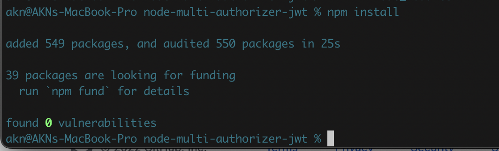
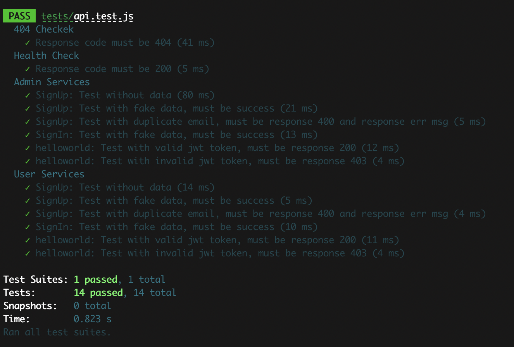
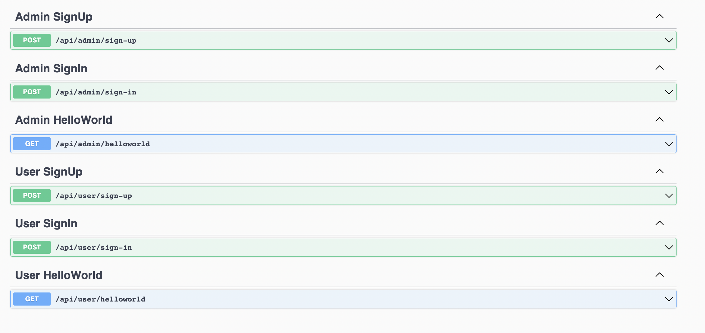

# Multiple Authorizer in Nodejs JWT
This is for coding test.  
Multiple Authorization in Nodejs JWT

[](https://github.com/helloakn/node-multi-authorizer-jwt) 
[](https://github.com/helloakn/node-multi-authorizer-jwt) 
[](https://github.com/helloakn/node-multi-authorizer-jwt) 
[](https://github.com/helloakn/node-multi-authorizer-jwt)
[](https://github.com/helloakn/node-multi-authorizer-jwt)


## Table of Contents
- File Structure
- npm Dependences
- How to Install
- How to Run
- How to Test
- Swagger

### File Structure
Structure is base on lambda functions.  
So we can easily deploy to lambda or ECS or EC2 as the monolith or microservice.  
We can separate authorizer and functions too.  
All the services on our code would be functions in Lambda and middleware will be lambda Authorizer as well as all the others are the layers.
```nth
.
├── data                        # dir for sqlite3 database
|   └── codetest.sqlite3        # sqlite3 db file
├── sc                          # nodejs source code
│   ├── common                  # for the common functions
│   ├── lib                     # just for system configuration files
│   ├── routes                  # urls and prefixs
│   │   └── ...
│   └── services                # Controllers , we can deploy them to AWS Lambda functions
│       ├── admin               # For all admin functions
│       │   └── ...
│       └── user                # For all user functions
│           └── ...
├── tests                       # api test
├── resources                   # for documentations resources
├── README.md              
└── ...
```
### npm Dependences

* [cors](https://www.npmjs.com/package/cors) ^2.8.5 - for api cors allown and deny
* [dotenv](https://www.npmjs.com/package/dotenv) ^16.0.0 - to load environment variable from .env file or sys environment variable
* [express](https://www.npmjs.com/package/express) ^4.18.1 - for web app
* [sqlite3](https://www.npmjs.com/package/sqlite3)  ^5.0.6 - to use as local storage  
* [md5](https://www.npmjs.com/package/md5)  ^2.3.0 - for one way password hex 
* [jsonwebtoken](https://www.npmjs.com/package/jsonwebtoken)  ^8.5.1 - JWT  
* [swagger-jsdoc](https://www.npmjs.com/package/swagger-jsdoc)  ^6.2.1 - for api doc 
* [swagger-ui-express](https://www.npmjs.com/package/swagger-ui-express)  ^4.3.0 - express api doc
* [jest](https://www.npmjs.com/package/jest)  ^28.0.3 - for unit testing
* [supertest](https://www.npmjs.com/package/supertest)  ^6.2.3 - for api testing 

### How to install
We have to install npm dependence to run our program smoothly. pls follow as the singlie line of  the following command.
```shell
npm install
```
  

## How to Run
Configuration is just for dev(local) only. we can easily execute our program in local as the following command.
```shell
npm run dev
```
## How to Test
I use jest and supertest npm package for testing. main program is base on commajs and jest is base on model type. however we can run and test our program because i have configured in package.json. You can check the testing source code in [./test](https://github.com/helloakn/node-multi-authorizer-jwt/tree/main/tests) directory too. 
Here is the command to run the testing.
```shell
npm test
```
  

## Swagger
we can accept our swagger from this link...  
[Link](http://localhost:9999/swagger/)  API Doc swagger -> http://localhost:9999/swagger/ 
We can test the api ourselves.

 

## Acknowledgement
Thank you all for giving me a chance to answer the coding test.  
I'm looking forward to work with you and I could make a promise that " I would do my best ".